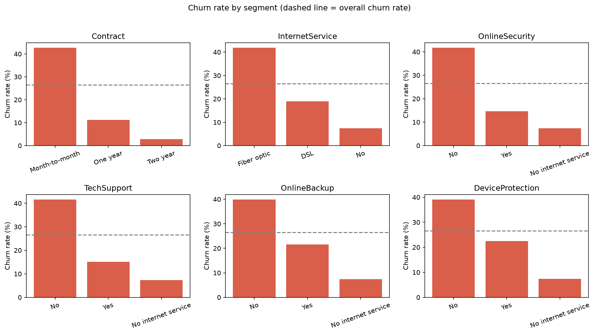
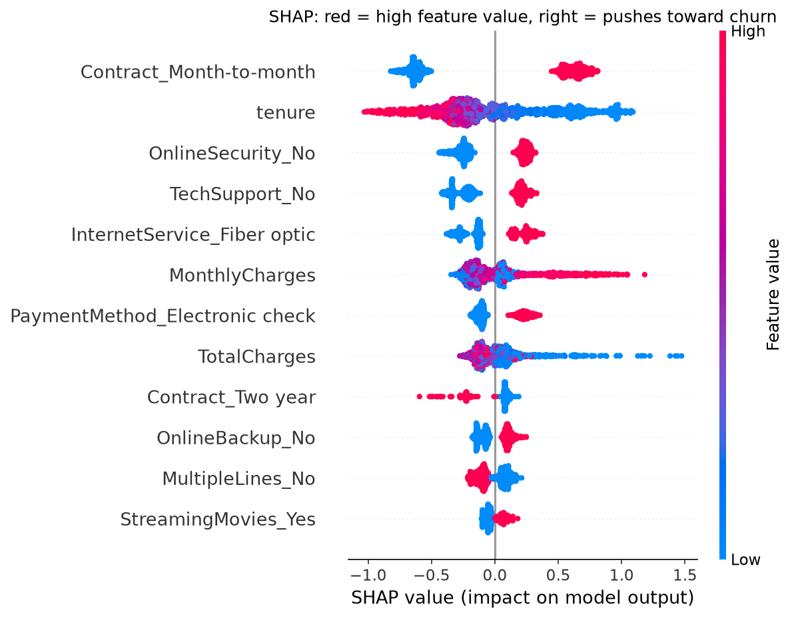
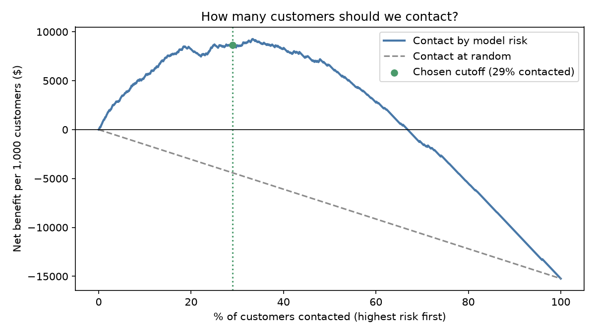
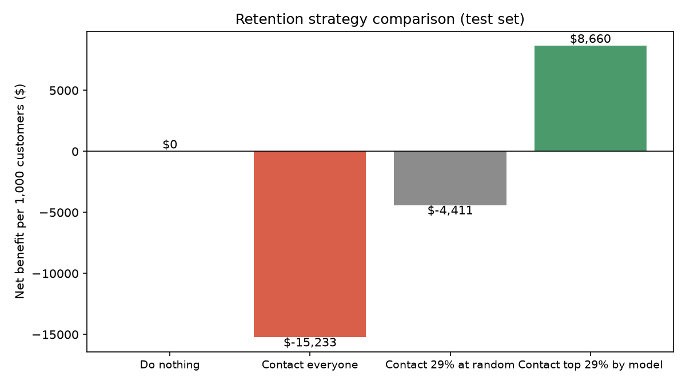

# customer-churn-prediction
# Customer Churn Prediction

An end-to-end machine learning project that predicts which telecom customers are likely to cancel, explains *why*, and turns the predictions into a cost-based retention strategy.

**Tech stack:** Python, pandas, scikit-learn, SHAP, matplotlib

## Key results

- **Data:** IBM Telco Customer Churn dataset, 7,043 customers and 20 features, with a 26.5% churn rate
- **Model:** gradient boosting reaches about **0.84 ROC-AUC** on held-out test data, compared against a logistic regression baseline
- **Biggest churn drivers:** month-to-month contracts, short tenure, and no online security or tech support
- **Business impact:** under stated assumptions, targeting the top 29% of customers by risk gives about **$8,750 net benefit per 1,000 customers**, while contacting everyone loses money

## What the data shows

| Segment | Churn rate |
|---|---|
| Month-to-month contract | 42.7% |
| Two-year contract | 2.8% |
| Fiber optic internet | 41.9% |
| No internet service | 7.4% |
| No online security / tech support | about 42% |
| Has online security / tech support | about 15% |



## Explaining the model with SHAP

SHAP values show how each feature pushes a customer's churn risk up or down.



## Business impact

A model is only useful if it changes a decision. I chose the risk cutoff on a separate validation set, then measured results on a held-out test set.

**Assumptions (illustrative, adjustable from the command line):** $50 per retention offer, 30% of contacted churners saved, 12 months of revenue at a 50% margin.




Contacting everyone loses money under these assumptions. Targeting the highest-risk 29% is profitable. The result is sensitive to the offer success rate, so `charts/sensitivity.csv` shows how it changes from 10% to 50%.

## How to run

```
git clone https://github.com/srishtichawla/customer-churn-prediction.git
cd customer-churn-prediction
python3 -m venv venv
source venv/bin/activate
pip install -r requirements.txt

python prepare_telco.py
python churn_model.py --csv telco_clean.csv --target Churn --id customerID
python churn_analysis.py --csv telco_clean.csv --target Churn --id customerID
python churn_business_impact.py --csv telco_clean.csv --target Churn --id customerID
```

## Project structure

| File | Purpose |
|---|---|
| `prepare_telco.py` | Downloads and cleans the dataset |
| `churn_model.py` | Trains and compares models, scores customers |
| `churn_analysis.py` | Exploratory charts and SHAP explainability |
| `churn_business_impact.py` | Cost-based targeting and net benefit analysis |
| `charts/` | Generated figures |

## Limitations

- The dollar figures rest on assumed costs and save rates, not real company data.
- The dataset has no dates, so the model was tested on a random split rather than on future customers.
- Models use fixed hyperparameters and were not extensively tuned.

## Data source

IBM sample dataset "Telco Customer Churn", widely available on Kaggle.
