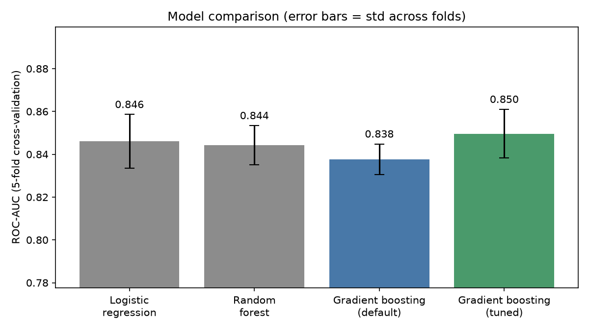
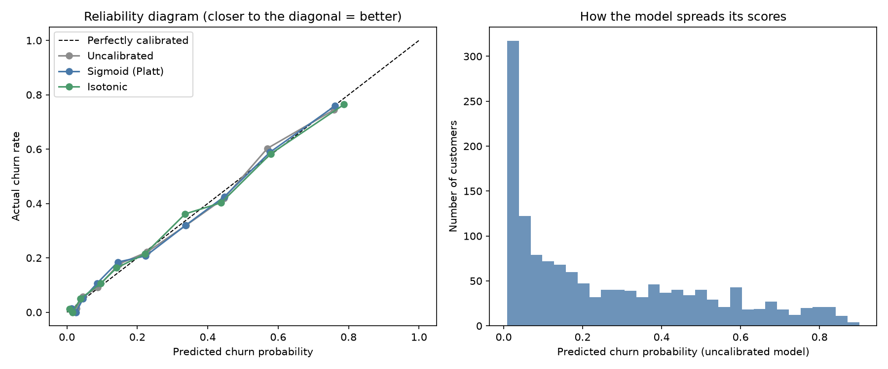

# Customer Churn Prediction

An end-to-end machine learning project that predicts which telecom customers are likely to cancel, explains *why*, and turns the predictions into a cost-based retention strategy.

**[Live demo](https://customer-churn-prediction-hkedx4enxadhcr5uyxsmbl.streamlit.app/)**: enter a customer's details and see their churn risk, the main reasons, and whether a retention offer is worth it. (Free hosting, so the first load after a quiet period can take about 30 seconds.)

**[Analysis notebook](churn_analysis_notebook.ipynb)**: a narrated walkthrough of the whole project, with charts and outputs.

**Tech stack:** Python, pandas, scikit-learn, SHAP, matplotlib, Streamlit

## Key results

- **Data:** IBM Telco Customer Churn dataset, 7,043 customers and 19 features, with a 26.5% churn rate
- **Model:** tuned gradient boosting reaches about **0.85 ROC-AUC** (0.850 in 5-fold cross-validation, 0.847 on a held-out test set)
- **Model comparison:** logistic regression, random forest, and gradient boosting were compared with cross-validation. The gains from tuning were modest, and a simple logistic regression baseline came close (0.842 test AUC)
- **Calibration:** predicted probabilities were checked with reliability diagrams and Brier score. The model was already well calibrated (calibration error about 0.02), so scores can be used directly as probabilities
- **Biggest churn drivers:** month-to-month contracts, short tenure, and no online security or tech support
- **Business impact:** under stated assumptions, targeting the top 29% of customers by risk gives about **$8,750 net benefit per 1,000 customers**, while contacting everyone loses money

## What the data shows

| Segment | Churn rate |
|---|---|
| Month-to-month contract | 42.7% |
| Two-year contract | 2.8% |
| Fiber optic internet | 41.9% |
| No internet service | 7.4% |
| No online security / tech support | about 42% |
| Has online security / tech support | about 15% |


## Model comparison and tuning

Four models were compared with 5-fold cross-validation on the training set, and scored once on a held-out test set. Gradient boosting was tuned with a randomized search over 30 hyperparameter combinations.

| Model | CV ROC-AUC | Test ROC-AUC |
|---|---|---|
| Logistic regression | 0.846 | 0.842 |
| Random forest | 0.845 | 0.842 |
| Gradient boosting (default) | 0.838 | 0.835 |
| Gradient boosting (tuned) | 0.850 | 0.847 |

The differences between the top models are within the fold-to-fold variation, so the simple interpretable baseline is nearly as good.



## Explaining the model with SHAP

SHAP values show how each feature pushes a customer's churn risk up or down.


## Probability calibration

A churn score is only useful for money decisions if it behaves like a real probability. The reliability diagram shows that customers scored around 30% churn about 30% of the time, and sigmoid and isotonic calibration made almost no difference.



## Business impact

A model is only useful if it changes a decision. I chose the risk cutoff on a separate validation set, then measured results on a held-out test set.

**Assumptions (illustrative, adjustable from the command line and in the live demo):** $50 per retention offer, 30% of contacted churners saved, 12 months of revenue at a 50% margin.


Contacting everyone loses money under these assumptions. Targeting the highest-risk 29% is profitable. The result is sensitive to the offer success rate, so `charts/sensitivity.csv` shows how it changes from 10% to 50%.

## How to run

```
git clone https://github.com/srishtichawla/customer-churn-prediction.git
cd customer-churn-prediction
python3 -m venv venv
source venv/bin/activate
pip install -r requirements.txt

python prepare_telco.py
python churn_model.py --csv telco_clean.csv --target Churn --id customerID
python churn_analysis.py --csv telco_clean.csv --target Churn --id customerID
python churn_tuning.py --csv telco_clean.csv --target Churn --id customerID
python churn_calibration.py --csv telco_clean.csv --target Churn --id customerID
python churn_business_impact.py --csv telco_clean.csv --target Churn --id customerID
```

To run the demo app locally:

```
pip install streamlit
cd streamlit_app
streamlit run app.py
```

To run the notebook yourself:

```
pip install jupyter
jupyter notebook churn_analysis_notebook.ipynb
```

## Project structure

| File | Purpose |
|---|---|
| `prepare_telco.py` | Downloads and cleans the dataset |
| `churn_model.py` | Trains a baseline and a gradient boosting model, scores customers |
| `churn_analysis.py` | Exploratory charts and SHAP explainability |
| `churn_tuning.py` | Cross-validation, hyperparameter tuning, model comparison |
| `churn_calibration.py` | Calibration analysis and expected-profit targeting |
| `churn_business_impact.py` | Cost-based targeting and net benefit analysis |
| `churn_analysis_notebook.ipynb` | Narrated walkthrough of the full analysis with outputs |
| `streamlit_app/` | Interactive demo app |
| `charts/` | Generated figures and result tables |

## Limitations

- The dollar figures rest on assumed costs and save rates, not real company data.
- The dataset has no dates, so the model was tested on a random split rather than on future customers.
- The data has no record of who received retention offers, so the model predicts who is likely to churn, not who would respond to an offer (uplift modeling would need that).
- The demo app's "main reasons" are a simple what-if approximation, not full SHAP values.
- Results can differ slightly in the third decimal between runs and library versions.

## Data source

IBM sample dataset "Telco Customer Churn", widely available on Kaggle.
